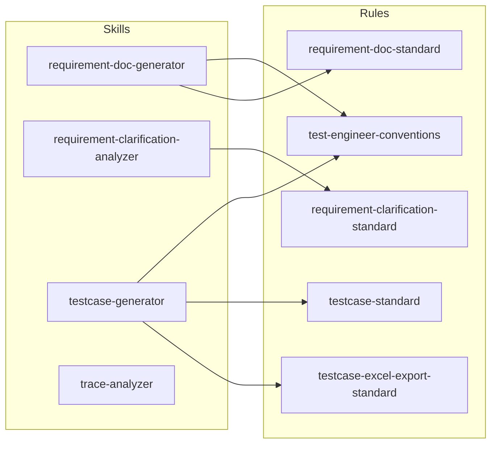

# Cursor QA 测试资产包

测试工程师在 Cursor 中使用的 **Agent Skills** 与 **Rules** 汇总，便于上传 GitLab、团队共享或换账号后恢复。

## 目录结构

```
cursor-qa-kit/
├── README.md                 # 本说明
├── INSTALL.md                # 安装到本机 Cursor 的步骤
├── INVENTORY.md              # 资产清单与触发词
├── .gitignore
├── skills/                   # 个人 Skill（复制到 ~/.cursor/skills/）
│   ├── testcase-generator/
│   ├── requirement-doc-generator/
│   ├── requirement-clarification-analyzer/
│   └── trace-analyzer/
└── rules/                    # 用户 Rule（复制到 ~/.cursor/rules/）
    ├── test-engineer-conventions.mdc
    ├── testcase-standard.mdc
    ├── testcase-excel-export-standard.mdc
    ├── testcase-standard.mm
    ├── requirement-doc-standard.mdc
    └── requirement-clarification-standard.mdc
```

## Skills 一览（4 个）

| Skill | 用途 | 典型触发语 |
|-------|------|------------|
| **testcase-generator** | 根据 PRD/接口文档生成标准化测试用例（md/xlsx/mm） | 「生成用例」、`@` 需求文档 |
| **requirement-doc-generator** | 整理测试侧需求清单，提取 PRD 内嵌验收/测试场景 | 「生成需求清单」「需求整理」 |
| **requirement-clarification-analyzer** | 需求澄清分析，对照 PRD 测试用例找缺口与冲突 | 「分析需求」「澄清需求」 |
| **trace-analyzer** | traceId 全链路日志、时序图、可选 DB/GitLab 定位 | 提供 traceId、排查跨服务问题 |

## Rules 一览（6 个）

| Rule 文件 | 作用 | alwaysApply |
|-----------|------|-------------|
| **test-engineer-conventions.mdc** | 工作区 `test/` 目录结构、落盘路径、`test_` 命名 | ✅ |
| **testcase-standard.mdc** | 用例字段、编号、优先级、覆盖维度 | ✅ |
| **testcase-excel-export-standard.mdc** | xlsx/mm 导出列序、单 Sheet、模块合并 | ✅ |
| **testcase-standard.mm** | 思维导图结构参考 | — |
| **requirement-doc-standard.mdc** | 需求清单须提取 PRD 内嵌测试场景 | 按 glob |
| **requirement-clarification-standard.mdc** | 澄清文档须对照 PRD 验收标准 | ✅ |

> Skills 与 Rules **配套使用**：例如 `testcase-generator` 会引用 `testcase-standard.mdc` 等规范。

## 依赖关系



## 安全说明

- **不要提交** `skills/trace-analyzer/config.yaml`（含内网地址、数据库密码、GitLab Token）。
- 仓库内仅保留 `config.example.yaml`；克隆后复制为 `config.yaml` 并填写本机配置。
- 上传 GitLab 前请确认 `.gitignore` 已生效。

## 下一步

1. 阅读 [INSTALL.md](./INSTALL.md) 了解本机安装方式。
2. 将本目录推送到 GitLab（提供地址后可协助 `git init` / 首次提交）。
3. 换 Cursor 账号后：重新执行 INSTALL，或改为项目级 `.cursor/skills/` + `.cursor/rules/`。
